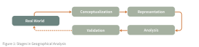

# __Course Information__  

__A PDF version of this syllabus is available [here](syllabus.pdf)__.

GEOG 281A is designed to help students design rigorous geographic research by connecting the development and use of core spatial methods to their theoretical foundations in geographic information science (GIScience). Readings and activities in the course are sequenced to help students enhance their spatial thinking skills and prepare to apply those skills to research problems using geographic information systems (GIS). Students explore fundamental topics including ontology and spatial representation, uncertainty, spatial modeling and inference, and validation through open science practices. 

This course teaches students to think critically about the nature of spatial processes, their representation as spatial data, and their analysis using spatial methods. As decisions are made about each of these issues, uncertainty enters into an analysis __(Figure 1)__. That uncertainty can contribute to inferential errors and/or a mismatch between a researchers understanding of reality and relaity itself. The goal of thic course is to prepare students to engage in deep geographic scholarship rather than simply apply GIS tools in specific domains.

---

## __Contact and Availability__

- Instructor: Peter Kedron
- Email: [peterkedron@ucsb.edu](mailto:peterkedron@ucsb.edu)
- Office: Ellison Hall 5818
- Availability: By appointment
- Class Time and Location: Wednesdays 9:30-11:50 AM, Ellison Hall 4824

## __Course Schedule__

 | Week | Topic | Primary | Additional |
 | --- | --- | --- | --- |
 | __1__ | __Spatial Thinking__   [Lecture Slides](slides/Spatial-Thinking.pdf)| [Golledge (2008)](readings/wk1/Golledge2008.pdf)   [National Research Council (2006)](readings/wk1/NRC_2006.pdf)   [Jo & Bednarz (2009)](readings/wk1/Jo_2009.pdf)| Lynch (1960)   [Marsh et al. (2007)](readings/wk1/Marsh_2007.pdf)   [Lobben & Lawrence (2015)](readings/wk1/Lobben_2015.pdf) |
 | __2__ | __Defining and Re-defining GIScience and Geography__   [Lecture Slides](slides/Redinfing-GIScience.pdf)| [Wright et al.(1997)](readings/wk2/wright1997.pdf)   [Fisher (1998)](readings/wk2/fisher1998.pdf)  [Mark (2000)](readings/wk2/mark2000.pdf)   [Goodchild (2004)](readings/wk2/goodchild2004.pdf)   [Guan et al.(2019)](readings/wk2/guan2019.pdf)   [Ricker et al.(2020)](readings/wk2/ricker2020.pdf) | [Pickles (1997)](readings/wk2/pickles1997.pdf)   [Waters (2019)](readings/wk2/waters2019.pdf)   [Goodchild(2019)](readings/wk2/goodchild2019.pdf)   [Scheider et al.(2020)](readings/wk2/scheider2020.pdf)   [O'Sullivan (2024) - C9](readings/wk2/CGChapter9.pdf) |
| __3__ | __The Nature of Space, Place, & Process__ | [Fisher et al.(1998)](readings/wk3/fisher1998.pdf)   [O'Sullivan (2024) - C2](readings/wk3/CGChapter2.pdf)   [O'Sullivan (2024) - C4](readings/wk3/CGChapter4.pdf)   [O'Sullivan (2024) - C8 - P211-226](readings/wk3/CGChapter8-1.pdf) | Grano (1929)   Mark & Egenhoffer (1995) |
| __4__ | __Representation of Processes & Objects as Spatial Data__| [Vector Formats](https://gistbok-topics.ucgis.org/CV-02-003)   [Raster Formats](https://gistbok-topics.ucgis.org/CV-02-020)    [Spatial Database](https://gistbok-topics.ucgis.org/DM-01-001)   [GeoDatabase](https://gistbok-topics.ucgis.org/DM-01-004) | [Data Model Conversions](https://gistbok-topics.ucgis.org/DM-06-086)   [Generalization](https://gistbok-topics.ucgis.org/DM-06-085)   [Large Database Problems](https://gistbok-topics.ucgis.org/DM-01-070) |
| __5__ | __Cartography & Geovisualization__| [Monmonier (1991) Chapter 2-3](readings/wk5/Monmonier2-3.pdf)   [Roth (2024)](readings/wk5/Roth2024.pdf)   [Roth (2013)](readings/wk5/Roth2013.pdf)   [Roth et al. (2017)](readings/wk5/Roth2017.pdf)   [Cartography and Science](https://gistbok-topics.ucgis.org/CV-01-001)   [Geovisualizations](https://gistbok-topics.ucgis.org/CV-05-035)| [Imhof (1975)](readings/wk5/Imhof-1975.pdf)   [Cleland (1921)](readings/wk5/Cleland18-26.pdf)   [Houtman (2026)](readings/wk5/Houtman2026.pdf)   [Robinson et al. (2017)](readings/wk5/Robinson2017.pdf)   [Bartling et al. (2021)](readings/wk5/Bartling2021.pdf) |
| __6__ | __Scale and Projection__ | [Openshaw & Taylor (1979)](readings/wk6/openshaw1978.pdf)   [Montello (1993)](readings/wk6/montello93.pdf)    [O'Sullivan (2024) - C3](readings/wk6/Chapter3.pdf)   [Spielman's Note](readings/wk6/spielman.pdf) | [Goodchild (2004)](readings/wk6/goodchild04.pdf)   [Frazier (2023)](readings/wk6/frazier23.pdf) |
| __7__ | __Spatial Relationships__ | Egenhofer & Franzosa (1991)   [Topological Relationships](https://gistbok-topics.ucgis.org/DM-01-028)   Mark & Egenhoffer (1995)   O'Sullivan (2024) - C6 | Stell (2017)   Westveld & Knowles (2021) |
| __8__ | __Spatial Analyses__ | Anselin (1989)   [Laws in Geography](https://gistbok-topics.ucgis.org/FC-05-043) | TBD |
| __9__ | __The Forking Paths of Uncertainty__ | TBD | TBD |
| __10__ | __GIScience & Society__ | TBD | TBD |

## __Student Work and Evaluation__

Evaluation will be based on participation (30%), weekly questions (15%), activities (15%), and a literature critique (40%).

### __Class Participation (30%)__

Students are expected to come to class prepared and participate in class discussions and activities. Because this course asks you to develop and refine your spatial thinking through dialogue, participation is essential to the learning process. Participation will be evaluated throughout the course using the following scale:

- __30% — Fully Engaged Contributor__ Student comes to class prepared and contributes regularly without dominating. Contributions advance the conversation in substantive ways. For example, by connecting ideas across readings, raising productive complications, offering concrete examples from their own research domain, or helping the group work through a difficult concept. Shows genuine interest in and respect for others' perspectives. Actively participates in all group activities, including taking on different roles (e.g., facilitating, questioning, synthesizing) rather than defaulting to the same mode each time.
- __~20% — Consistent Participant__ Student comes to class prepared and makes thoughtful contributions that reflect engagement with the material. Shows interest in and respect for others' views. Participates actively in small group work. Contributions are sound but tend to stay within the frame the readings or instructor have already established, rather than extending or challenging it.
- __~15% — Present but Passive__ Student comes to class prepared and follows the discussion but contributes only minimally — for example, only when called upon or only in small group settings. Does not disrupt but does not help move the intellectual work of the class forward. May be absorbing ideas but is not yet making them visible to others.
- __~5% — Underprepared__ Student comes to class only partially prepared and contributes rarely. When contributions are made, they suggest limited engagement with the readings or activities. Participation in group work is inconsistent.

### __Questions (15%)__

Conducting research in any field is largely about asking questions. Students are required to submit three questions by __9am Tuesday of each week__ about the readings for that week. These questions will be reviewed prior to class, and selected questions will be integrated into class activities for the week. Questions are the one activity where you are __NOT ALLOWED to use AI__. The point of the questions requirement is to have you engage with the materials and practice your critical and creative thinking skills. If you use AI to generate your questions, you will receive a zero for all your questions for the entire course.

__You will submit your questions through a Google Form each week. Here is link to the [form](https://docs.google.com/forms/d/e/1FAIpQLSfuErQKnnmi2xVmNqSqwjIg8WjvZQ7ztC6dLUx8c9k1qDdg7w/viewform?usp=publish-editor)__.

Questions will be graded using the following criteria.

- __5 - Exceptional__ The question identifies a tension, gap, or unstated assumption in the reading and connects it to a broader issue in GIScience or the student's own research. It could not be asked without having carefully read and reflected on the material. It opens a line of inquiry that would productively drive class discussion.
- __4 - Strong__ The question demonstrates genuine engagement with the reading's argument or methods and goes beyond what the text explicitly states — for example, by questioning an author's framing, proposing a counterexample, or drawing a connection across readings. Minor refinement in specificity or depth would elevate it further.
- __3 - Adequate__ The question shows that the student read the material and understood its main points, but stays close to the surface. It may ask about something the reading already addresses, seek clarification on a concept without pushing further, or be too broad to anchor a productive discussion.
- __2 - Superficial__ The question is vaguely related to the topic but could have been written from the abstract or introduction alone. It does not engage with the reading's core argument, methods, or evidence, and suggests only minimal engagement with the material.
- __1 - Insufficient__ The question is generic enough to apply to almost any reading (e.g., "Why is this important?"), is factual in a way that a quick search would resolve, or reflects a fundamental misreading that suggests the material was not read.

### __Activities (15%)__

Students will be asked to participate in activities throughout the course. Activities are intended to serve as practice and checks on student knowledge. You are welcome and encouraged to work with your classmates on these exercises. Most will be done entirely in class. However, you are responsible for submitting your own individual solution report for each activity when requested.

### __GIScience Project (40%)__

This project is intended to deepen students engagement with the conceptual foundations of GIScience, while also encouraging them to critically evaluate how those concepts relate to applied topic. The final critique is due at the end of the quarter. Students have three options for their GIScience Research course project.

1. __Collective Literature Critique:__ This is a group project option. The work will be done in collaboration with a group of students in the class. Over the course of the quarter, the students in each group will develop a critique of a body of published literature in GIScience or a related domain. The critique should evaluate the literature using of the frameworks covered in class.

2. __Individual Research Critique:__ This is an individual project option. Students interested in exploring the connection between their own research topic and GIScience (e.g., in preparation for the comprehensive exam) may pursue the literature critique individually. In this instance, the student will examine their own research topic as it relates to the GIScience literature. The goal of the project is for the student to deepen their own work by enriching it through the use of GIScience and spatial concepts, and/or to identify how their research will contribute to GIScience as a field of study.

3. __Technical Exploration of a GIScience Topic:__ This is a group or individual project option. Students interested in the computational implementation and execution of spatial concepts or techniques may develop a vignette exploring and explaining that concept and its implementation in a computational environment (I suggest Python or R). The goal would be to develop a vignette that could be used to teach this concept to an advanced undergraduate audience. Developing teaching materials is often one of the best ways to really understand a topic.

Complete details about each option and the assessment criteria that will be used to evaluate student work is available __[GIScience Project Description](gisciproject.pdf)__