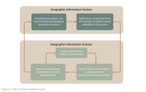

# __The Tool Science Debate in GIScience__

As GIS and GIScience emerged as technologies and a field of study near the end of the 20th century, an essential question was repeatedly asked - *What is GIScience?*. 
A vigorous debate emerged within the geographic community over whether a substantive difference existed between GIS and GIScience, whether GIS was itself a tool or field of study, and whether GIScience warrented being labelled as a science. 
Scholars have taken different perspectives and offered different answers to these questions.
Consider three metaphors that attempt to clarify the distinction and connection between GIS and GIScience as - a continuum (Wright et al. 1997), a bi-cyclic system (Fisher 1998), and an investigative matrix.

## __A Tool-Science Continuum__

Wright et al. (1997) argue that GIS should not be classified strictly as either a tool or a science, but should be instead understood along a continuum. 
Labeling GIS as either a tool or a science is too limiting because a tool is of little use without the foundation of a meaningful science, and science cannot advance without the use of tools. 
Scientific knowledge is needed to properly use the GIS as a tool and that tool allows individuals to better understand a scientific question. 

To link the tool-science binary, Wright et al. (1997) suggest a continuum. 
On one end of the continuum, GIS is a tool <a class="sidenote-ref" href="#sn-1">1</a>or technical instruments that support research, analysis, and decision-making in other disciplines. 
On the other end, GIS is a science <a class="sidenote-ref" href="#sn-2">2</a> that studies geographic concepts and their use in creating geographic information. 
In betwen the two ends of the continuum GIS is a toolmaking process <a class="sidenote-ref" href="#sn-3">3</a> that embeds scientific ideas into systems—these roles coexist rather than compete (__Figure 1__).

<strong>1.</strong> GIS does not itself generate new scientific knowledge; rather, it provides methods for storing, visualizing, manipulating, and analyzing spatial data in service of externally defined research questions.

<strong>2.</strong> Including how geographic phenomena are conceptualized, represented, modeled, analyzed, and understood, independent of any specific application domain. fundamental research questions

<strong>3.</strong> The design, development, and refinement of GIS software, algorithms, data structures, and analytical techniques.

## __A Bi-cyclic System__

Responding to Wright et al. (1997) and other attempts to define the nature and position of GIS and GIScience, Fisher (1998) argues that conceptualizing GIS-GIScience as a continuum is problematic.
Central to Fisher's argument is the idea that the continuum metaphor leads to a false polarization that misses, or at least minimizes, important interactions between concept innovation and tool development.
Specifically, the continuum metaphor could be read to imply that the users of a GISystem are not be indulding in a valid scientific endevour unless it is in the scientific domain of their subject.
This implication is problematic first because many individuals both use existing GISystems to develop new and interesting spatial theory, and second because individuals developing new spatial concepts may also test and develop those concepts by moving them into GISystems.

To resolve this tension, Fisher presents an alternative metaphor (__Figure 2__).
Rather than a continuum, Fisher argues that there are two related cycles of development that are continually interacting.
At a conceptual level, geographers and GIScientists are continually developing spatial concepts that could potentially be used to represent and analyze processes occuring in the real world.
Through time those spatial concepts are critiqued and revised, and some of those concepts become part of an established set.
At the same time, subsets of the available spatial concepts are operationalized within a computational framework as a particular GISystem.
At a systems level, those selected concepts are then used to study geographic patterns and processes.
As these tools succeed or fail in capturing and analyzing those processes they are revised, as are the concepts that underlie them<a class="sidenote-ref" href="#sn-4">4</a> .

<strong>4.</strong> Fisher's metaphor inherits many ideas from Kuhn's notion of scientific paradigms and the progression of normal science.

In this model, GIScience and GIS systems co-evolve. Scientific concepts inform system development; systems are then used in applications; applications generate feedback that reshapes scientific understanding.
Rather than asking whether GIS is a science, Fisher asks how scientific knowledge is produced through practice, implementation, critique, and revision.
GISystems are not secondary to science—they are part of how science happens<a class="sidenote-ref" href="#sn-5">5</a>.

<strong>5.</strong> Pickles (1997) similarly challenges the framing of the tool–science debate, but from a different pespecitve.
He argues that the binary tool-science debate abstracts GIS from its social, political, and institutional contexts.
Specifically, Pickles is skeptical of attempts to legitimize GIS purely through claims of scientific neutrality or technical sophistication.
In addition to asking “What is GIS?”, we need to think about “What does GIS do, and for whom?”

While Fisher emphasizes epistemic cycles between systems and science, Pickles foregrounds the social embedding of those cycles:who controls them, who benefits from them, and whose knowledge is excluded.
Pickles argument is an early development what later becomes Critical GIS.
His edited book <em>Ground Truth</em> is a seminal work in this sub-field of GIScience and one of the first synthetic surveys of these arguments.

## __An Investigative Matrix__ 

Returning to this GIScience-GISystems debate almost 30 years later, Ricker et al. (2020) argue that continuing this debate is counterproductive, especially in interdisciplinary research contexts.
They propose a alternative role-based framework.
Ricker et al. point out that GISystems can function as a tool (basic use of existing software), toolmaking (custom development and system design), or science (advancing spatial theory, methods, and critical understanding).
Rather than resolving the debate on function, the authors shift the debate from attempting to decide what GIS “really is,” to explicitly identifying __which role GIS plays in a given project and what expertise is required for GIS to play that role__.
If focus shifts from a philosophical debate to practical guidance, then GIScience no longer needs to prove it is a science.
Instead the task for GIScientists becomes clarifying the responsibilities, expertise, and ethical implications of practices that use spatial concepts and/or GISystems.

This conception of GISsystems and GIScience as a practuce aligns with broader practice-centered views of scientific knowledge articulated within the philosophy of science.
For example, Waters (2016) presidential address to the *Philosophy of Science Association* argue that scientific inquiry operates within an investigative matrix (__Figure 3__)that links data, material techniques, models, and explanations through iterative manipulation of phenomena in the world.

  

According to Waters core theory informs these investigations, but it does not dictate them; instead, explanations emerge from the interaction between theoretical commitments and practical engagements with phenomena.
This view also resonates strongly with Fisher’s critique of the tool–science metaphor in GIScience.
Just as GIS applications are not mere implementations of pre-existing theory, scientific knowledge more broadly is generated through cycles of experimentation, critique, and refinement rather than linear application of theory to the world.
Practices lead to revisions of GISystems and spatial concepts as researchers work to make sense of complicated geographic phenomena. 

---

Reference:

*Wright, D. J., Goodchild, M. F., & Proctor, J. D. (1997). GIS: tool or science? Demystifying the persistent ambiguity of GIS as "Tool" versus "Science". Annals of the Association of American Geographers, 346-362.*

*Pickles, J. (1997). Tool or science? GIS, technoscience, and the theoretical turn.*

*Ricker, B. A., Rickles, P. R., Fagg, G. A., & Haklay, M. E. (2020). Tool, toolmaker, and scientist: case study experiences using GIS in interdisciplinary research. Cartography and Geographic Information Science, 47(4), 350-366.*

*Waters CK. Presidential Address, PSA 2016: An Epistemology of Scientific Practice. Philosophy of Science. 2019;86(4):585-611.*
