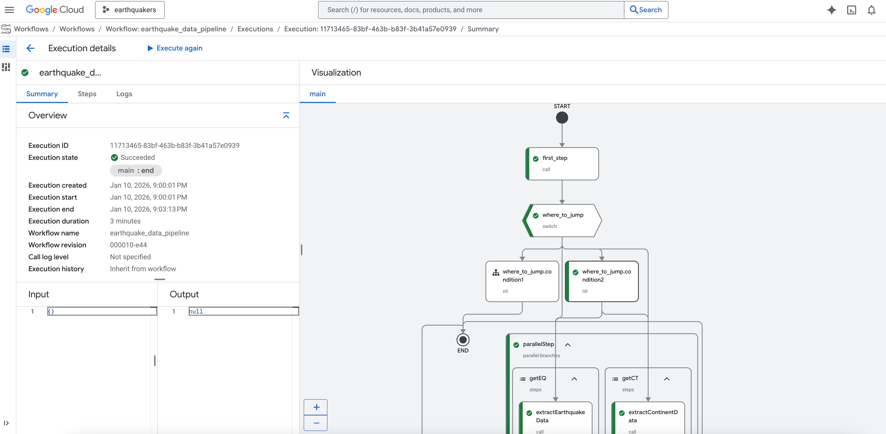

# __Spatial Database and Management__

In the previous lesson, we examined how geographic phenomena are represented through data models. But representing spatial data is only part of the story. Once spatial data are created, they must be stored, organized, queried, validated, and maintained (often at massive scale). When datasets become large, multi-layered, and interconnected, file-based storage (such as individual shapefiles or rasters) becomes insufficient. This is where spatial databases enter the picture. If data models define how spatial information is structured, spatial databases define how spatial information is managed.

We have briefly mentioned relational spatial databases as a technical manifestation of relational thinking. Now we examine that more closely to see how they bring together our data models within a system designed for more efficient analysis.

## __From Database to Spatial Database__

A database management system (DBMS) is a technology designed to organize, retrieve, update, and maintain structured data efficiently. Unlike simple file storage, where files are managed directly by an operating system, databases rely on logical organization. Data are structured into formal schemas that allow efficient querying and controlled modification.

At the core of any database system is a data model, which serves as the design framework governing how data are structured and manipulated. A complete data model contains three essential components: constructs for describing data structures, operations for manipulating those structures, integrity rules for validating data and ensuring consistency. Among these components, database operations generally follow the CRUD framework: create, retrieve, update, and delete. Integrity is maintained through transaction properties known as ACID: atomicity, consistency, isolation, and durability.
A spatial database management system (SDBMS) extends a traditional DBMS by incorporating spatial data types and spatial operations. In addition to basic types such as integers or text, an SDBMS supports geometric types such as: point, line string, polygon, and raster. It also supports spatial indexing structures (e.g., R-trees, Quadtrees) that allow efficient spatial querying.

Crucially, an SDBMS integrates constructs, operations, and rules across three levels of abstraction: conceptual level (how the world is modeled), logical level (how data are structured in tables or collections), and physical level (how data are actually stored and indexed on disk). In this way, spatial databases connect ontology (how we conceptualize space), data models (how we encode it), and implementation (how we store and manipulate it efficiently) well.

There are multiple logical database models used to implement database systems. Each reflects a different philosophy of data organization and relationship modeling. To name a few:

__Relational databases__ organize data into tables (relations), where rows represent entities and columns represent attributes. Relationships between tables are managed through keys and relational algebra operations. This model aligns strongly with structured, schema-driven data environments and remains the dominant model in GIS. Examples include: PostgreSQL with PostGIS (a spatial extension implementing standardized geometry types and spatial functions), MySQL with spatial extensions, and CartoDB (cloud-based system built on PostgreSQL/PostGIS).

__Graph database__ store data as nodes, relationships (edges), and properties. This model is inherently relational in structure and is grounded in graph theory. Nodes represent entities, edges represent relationships, and properties describe characteristics. Because relationships are first-class elements, graph databases are especially powerful for modeling relational space and network structures. Here, Neo4j is a prominent example, capable of building 1D and 2D spatial indexes such as B-tree, Quadtree, and Hilbert curve structures within the graph.

__Document-based databases__ store data as self-contained documents, often in JSON-like structures. They allow flexible, semi-structured storage without requiring rigid relational schemas. Examples include CouchDB (with GeoCouch spatial plugin) and Elasticsearch (supporting geo-point and geo-shape data types). These systems are often described as “NoSQL” because they do not rely strictly on relational algebra.

__Key-value databases__ store data as simple key-value pairs, optimized for rapid retrieval at fine granularity. Redis, with its Geo API, is an example that supports spatial indexing and ranking.

__Object-oriented databases__ store entities as objects that include both data and behavior (methods). Rules constrain behavior and interactions among objects. An example here is Smallworld VMDS.

__Open standards-based spatial databases__ follow constructs promulgated by organizations such as the Open Geospatial Consortium (OGC). They support standardized geometry types and operations, facilitating interoperability across systems. In this framework, vector geometries are often represented as “simple features,” meaning that geometry is stored without explicit relationship encoding beyond topology.

## __GeoDatabase__

Although the terms spatial database and geographic database (geodatabase) are often used interchangeably, they are not identical. A spatial database is a general-purpose database enhanced to store, query, and analyze data defined in geometric space. In contrast, a geodatabase is a more specialized type of spatial database designed specifically for geographic data. It stores not only spatial features and attributes but also spatial reference information that ensures correct geographic positioning.

Geodatabases come in different types, particularly within the Esri ecosystem, where three primary forms are recognized: file geodatabases, enterprise geodatabases, and mobile geodatabases (with the older personal geodatabase type now phased out). A file geodatabase is designed for simplicity and ease of use. It consists of a folder containing multiple files with a .gdb extension and can store both spatial and non-spatial datasets together. File geodatabases are well-suited for thematic or smaller-scale projects, as they are easy to copy and support fast read/write operations for moderate data volumes. However, they are limited in handling complex queries and multi-user editing.

An enterprise geodatabase, by contrast, is stored within a full database management system (DBMS) such as PostgreSQL, Oracle, or Microsoft SQL Server, and can also be deployed in cloud environments. It is designed to support simultaneous multi-user access and editing, making it suitable for large organizational or enterprise-scale workflows. Storage limits depend on the capabilities of the underlying DBMS, and security and permissions are managed through that system. Enterprise geodatabases do not have a unique file format; instead, they follow the structure of the DBMS in which they are implemented.

A mobile geodatabase is intended for use by a single user or application at a time and is built on SQLite. It stores datasets within a single .geodatabase file. Permissions and security are handled by the underlying operating system. Mobile geodatabases are optimized for portability and app-based workflows rather than large-scale, concurrent enterprise environments.

Geodatabases extend traditional database functionality by incorporating spatial querying capabilities. Like non-spatial databases, they allow attribute-based queries using SQL. However, their distinguishing feature is the ability to perform queries based on spatial relationships and location information. Because geodatabases typically rely on the vector data model, they can evaluate topological relationships between features. Examples of spatial relationships include “within,” “contains,” “intersects,” “touches,” and “disjoint.”

In systems such as PostGIS, spatial queries are written using SQL combined with spatial functions (e.g.ST_Within). These queries return Boolean results, selecting records that meet both attribute and spatial conditions. Spatial joins further extend analytical capabilities by combining datasets based on geographic relationships rather than shared attribute keys. Geodatabases also differentiate between geometry types operating in planar coordinate systems and geography types operating on a spheroidal Earth model. All of these features make geodatabases powerful tools for geospatial analysis.

Let's work through an example of a spatial query. Suppose we have a geodatabase containing two tables: blockgroups_2020, population_2020 and bus_stops (with stop locations) in a city (for example, Philadelphia). We want to estimate the population within 800 meters of each bus stop. This requires a spatial join between the two tables based on proximity.

If we were to conduct this analysis in a GIS software, we would use a spatial join tool that identifies all block groups within 800 meters of each bus stop and sums their populations. However, if working within a spatial database, we can write a SQL query that performs this operation directly (__Figure 1__).

```sql
/*
bg_w_pop creates a “block group with population” table by:
    - taking population counts from census.population_2020
    - joining them to block group geometries in census.blockgroups_2020
    - filtering to Philly-only block groups (geoid starts with 42101)
*/
WITH
bg_w_pop AS (
    SELECT
        pop.total,
        bg.geog,
        SUBSTRING(pop.geoid, 10) AS geoid
    FROM census.population_2020 AS pop
    INNER JOIN census.blockgroups_2020 AS bg ON SUBSTRING(pop.geoid, 10) = bg.geoid
    WHERE SUBSTRING(pop.geoid, 10) LIKE '42101%'
),
/* 
stop_pop spatially joins bus stops to block groups using ST_DWithin:
    - For each stop, find all Philly block groups within 800m
    - Sum their populations to get an estimated catchment population
*/
stop_pop AS (

    SELECT
        stops.stop_id,
        SUM(bg.total) AS estimated_pop_800m
    FROM septa.bus_stops AS stops
    INNER JOIN bg_w_pop AS bg ON ST_DWITHIN(stops.geog, bg.geog, 800)
    GROUP BY stops.stop_id
)
/*
as a finle step, we can join the estimated population back to bus stop attributes 
and filter to stops with more than 500 people within 800m
*/
SELECT
    stops.stop_name,
    pop.estimated_pop_800m,
    stops.geog
FROM stop_pop AS pop
INNER JOIN septa.bus_stops AS stops USING (stop_id)
WHERE pop.estimated_pop_800m > 500
ORDER BY pop.estimated_pop_800m ASC, stops.geog ASC
LIMIT 8
```

<a href="../../assets/sql-demo.png" class="zoomable">
    
</a>

__Figure 1__: SQL query to estimate population within 800m of bus stops in Philadelphia. 

## __Problems of Spatial Database__

However, there are also several problems associated with managing and working with large spatial databases. These challenges are closely tied to broader issues in big data and the management of big data.

Geospatial big data pose both computational and conceptual challenges. In modern practice, spatial database management rarely happens on a single desktop machine. Instead, data are stored in distributed environments, transformed through automated pipelines, and ingested into cloud databases. Architecturally, they require high-performance computing environments, distributed systems, and specialized processing frameworks to store and process massive volumes of data efficiently (__Figure 2__). 


__Figure 2__: Google Cloud Platform’s BigQuery spatial database pipeline. Source: https://cloud.google.com/bigquery/docs/spatial-data


Conceptually, however, they inherit fundamental geographic problems such as vague feature boundaries, positional uncertainty, scale effects, and spatial heterogeneity. Many large spatial datasets also lack rigorous sampling methods and clear pathways to replicability, which complicates scientific interpretation and methodological transparency.

Quality assessment is especially problematic. Traditional spatial datasets often follow established standards such as ISO 19157 for geographic data quality or lidar accuracy specifications. In contrast, many newer big data sources lack standardized quality controls. Spatial accuracy may be inferred from contextual clues rather than precise measurements, and sampling bias is common. As a result, increasing data volume does not necessarily guarantee increasing data reliability.

Geospatial big data streams, such as those derived from social media platforms or Internet of Things (IoT) sensors, introduce additional challenges because they require continuous ingestion, processing, and near real-time analytics. Although some sensor networks provide stable positional references, social media data often contain ambiguous or incomplete spatial components that must be resolved computationally through geocoding, disambiguation, or probabilistic matching.

That said, managing geospatial big data requires advanced data modeling, indexing, and structuring approaches. Traditional vector and raster models remain important, supported by spatial indexing techniques such as quadtrees, KD-trees, and R-trees. These indexing strategies enable efficient access to geometric, topological, and thematic attributes. Emerging approaches also incorporate ontologies and semantic structures to improve data integration and interpretation.

Analytical methods often rely on distributed and high-performance computing environments. Techniques include parametric and non-parametric statistics, spatial clustering, association rule mining, and functional analysis. Increasingly, machine learning and deep learning methods—such as convolutional neural networks—are used to extract patterns and knowledge from large spatial datasets. These methods are applied across remote sensing archives, sensor data streams, social media, and IoT networks.

---

Reference:

*Spatial Database Management Systems. In UCGIS Body of Knowledge. https://gistbok-topics.ucgis.org/DM-01-001*

*Geodatabases. In UCGIS Body of Knowledge. https://gistbok-topics.ucgis.org/DM-01-004*

*Problems of Large Spatial Databases. In UCGIS Body of Knowledge. https://gistbok-topics.ucgis.org/DM-01-070*

