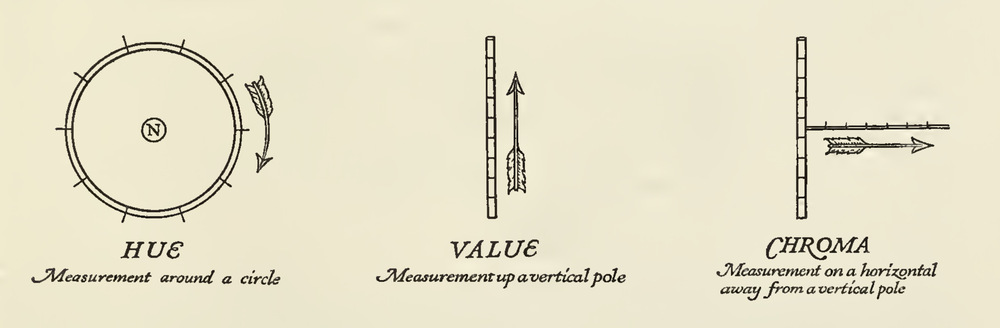
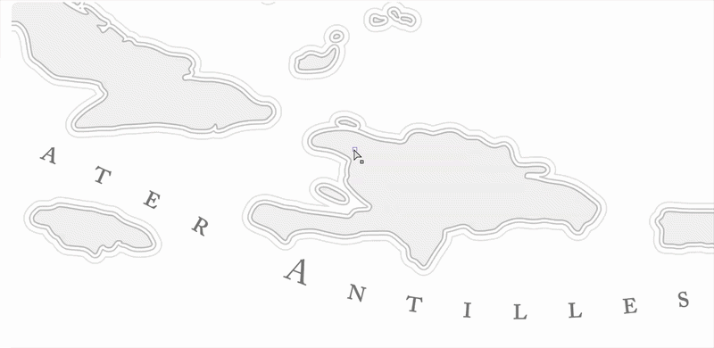
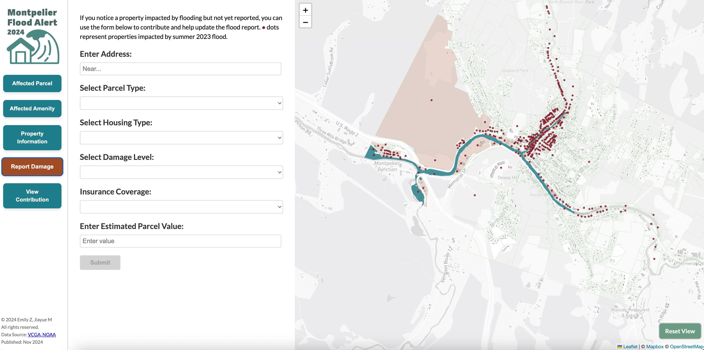

# __From Cartographic Representation to Interaction__

In previous lessons, we focused primarily on how knowledge is represented. In other words, how we take a complex world and encode it into structured forms, such as ontological frameworks (space, place, process), data models (raster and vector), and visualizations. However, representation is only one part of the story and only one stage in the broader process of geographical analysis. Recall the flow diagram from our course introduction: once knowledge is encoded, we still need to make sense of it. This involves interpreting, questioning, and ultimately drawing conclusions, which then become new knowledge about the world. Now, we need to shift our focus to the next stage: inference.

To ground this shift, we turn to __cartography__, where the transition from representation to inference is especially visible. Cartography has long been concerned with __representation__: how to effectively depict spatial phenomena on a map, whether on paper or screen, in ways that are clear and interpretable.

However, contemporary cartographic research has moved beyond representation alone. Increasingly, it asks:

- How are maps used?
- How do people interact with them?
- How do maps support reasoning and decision-making?

In other words, the focus has expanded from what a map shows to what a map enables us to do and understand. We will examine this shift from representation to __inference__ through the lens of maps and modern cartographic research. At the same time, it is important to note that these questions extend well beyond cartography. The same transition applies to many forms of geographic knowledge, including: statistical models, simulations, spatial decision support systems etc. Regardless of the specific form, the underlying challenge is the same: how do we move from encoded representations to meaningful interpretation and informed decisions?

## __Mapmaking and Representation in Cartography__

We begin by formally examining cartographic research practices whose primary focus is on representation and those concerned with inference.

Traditional cartography has long been grounded in a representational paradigm, where the central task is to design maps that effectively encode and communicate information about the world. The emphasis is on map-making:constructing visual representations that clearly and accurately convey a message. Within this paradigm, maps are understood as vehicles for communication, in which the cartographer encodes information, and the user decodes it. As such, research has focused heavily on optimizing this transmission, with particular attention to: clarity, accuracy, and perceptual effectiveness

This includes a wide range of design considerations, such as: fonts and typography, color selection and harmony, imagery and iconography, patterns and textures,tone and visual hierarchy, linework and stylistic choices, and many more.

For example, cartographers might ask:

- How many colors are appropriate to effectively convey information while maintaining visual harmony?
Does the thickness of linework or the density of patterns align with the importance of the features being represented?
- Are typographic choices consistent with the overall style and purpose of the map?
- How do we balance information clarity, aesthetic quality, cartographic conventions, and creative expression?

Summarized succinctly, research in this tradition has centered on four key elements of map design: __color, typography, iconography, and texture__ <a class="sidenote-ref" href="#sn-1">1</a>.

<strong>1.</strong> If you are interested in the full detail of map design, see the references from Mapbox <a href="https://www.mapbox.com/insights/map-design-process">here</a>

### __Color__

Color plays a central role in map design. It is used to attract attention, group similar elements, convey meaning, and enhance aesthetics. In practice, cartographers typically begin the design process by developing a color palette. This is often an iterative process, where colors are tested and refined in relation to the data, layout, and overall design goals. Research in this area engages with a range of concepts from color theory, including: balance and visual hierarchy, chroma (color intensity), color combinations and harmony, color systems (e.g., color trees), complementary and contrasting colors (__Figure 1__).

__Figure 1__: Three fundamental dimensions of color: hue, chroma, and lightness. Adapted from Cleland’s _A Grammar of Color_ [Page 13-26](../readings/wk5/Cleland18-26.pdf)<a class="sidenote-ref" href="#sn-2">2</a>.

<strong>2.</strong> The full book is available<a href="https://drive.google.com/file/d/1LWodg6b6Sg8-vzUBlG4ky6PuzNXDD_1v/view">here</a>

A long-standing question in cartographic design is: how many colors should be used in a map? In general, cartographers tend to use color conservatively. Human visual perception is limited, and overly complex color schemes can overwhelm the reader and reduce clarity. As a result, a limited and well-structured color palette is typically preferred. For many maps, a palette of approximately 10–12 colors is sufficient to support a full design while maintaining readability and coherence. However, the appropriate number ultimately depends on the complexity and purpose of the map.

Adhering to established cartographic color conventions is important as certain colors are commonly associated with specific types of features. For example, many features related to navigation and transportation are often represented using similar shades of black and red. This consistency helps users quickly associate colors with certain types of features, such as: rail labels, highway shields, ferry routes, and road casings.

Especially in many reference maps,color palettes are not arbitrary but follow established conventions. Over time, users have developed expectations that certain colors correspond to certain types of features (__Figure 2__). 

  

  

__Figure 2__: Examples of color conventions in cartography. Left: Mapbox's Streets style, which follows established conventions for green spaces and water features. Right: Google Maps, which also adheres to similar color conventions.

For example, in Google Map's color system, colors are organized not only by category but also by gradients within each category. Blue is consistently used for water, green for vegetation, yellow or beige for corridors and open land, gray for built environments, and red is reserved sparingly for high-salience features. Each category includes a range of tonal values (e.g., 50–800), allowing designers to adjust contrast and hierarchy while maintaining semantic consistency. Mapbox employs a refined palette in which land is shown in neutral beige tones, water in blue, greenspace in soft green, and transportation networks in distinct yet harmonized hues, with points of interest remaining muted but legible. Importantly, the effectiveness of these systems lies not in the specific colors themselves, but in the consistency of their mapping to meaning. Over time, users learn to intuitively associate blue with water, green with vegetation, and gray with urban or built environments.

An interesting pivot emerges here: is color always necessary?

__The answer is no!__

Cartographic research has also explored monochrome mapping, where maps are designed using a single color (or variations of a single hue). This approach challenges the assumption that more color leads to better communication. Monochrome map design rely on: value (lightness vs. darkness) to create contrast, texture and pattern to differentiate features, line weight and hierarchy to guide attention, and careful composition to maintain clarity without relying on hue differences (__Figure 3__).

Rather than reducing effectiveness, monochrome maps often enhance clarity by removing unnecessary visual complexity. They force the designer to think more carefully about: what information is most important
how visual hierarchy is constructed, and how different elements are distinguished without relying on color. In this sense, color is only one tool among many. Effective map design depends not on the number of colors used, but on how well visual variables are coordinated for effective representation.

  

  

__Figure 3__: Example of monochrome map design, adapted from [MonoCarto 2019](https://somethingaboutmaps.wordpress.com/monocarto-2019-winners/#BD)

### __Typography__

Typography (__Figure 4__) is also one of the most important design elements in a map and can make or break its readability. Labels, which account for most of the text on maps, are often only one to three words long and displayed at very small sizes. Given this constraint, fonts with taller x-heights, open counters, and minimal or no serifs tend to work best.

Effective typographic design requires balancing __quality and readability__. High-quality fonts offer a wide range of variations, including styles (italics, caps, caps italic, small caps), weights (from ultra light to ultra black), and widths (condensed, narrow, normal, mono, expanded). These variations allow designers to create hierarchy and differentiate between types of features.

Readability is not just about the font itself, but also about how text is arranged. This includes the classification of labels, the use of different label colors, and careful control of spacing so that the reader’s eye can access the content easily and clearly. At the same time, the personality of a typeface reflects the tone and energy of the map. The most common styles, sans-serif, serif, and script, each carry different visual qualities, with sans-serif fonts generally performing best on web and mobile due to lower screen resolution (DPI).

 

__Figure 4__: The Serene Practice of Map Labeling by Daniel Huffman. See full video [here](http://youtube.com/watch?v=UWo12NFdxJ0)

Research has also focused on label placement, such as the classic work by [Imhof (1975)](../readings/wk5/Imhof-1975.pdf) on positioning names on maps, which remains foundational in understanding how labels can be placed clearly without ambiguity.

On a related note, __typography and lettering (or labeling)__ are closely related but not identical, though they are often used interchangeably. Typography focuses on the selection and arrangement of typefaces, while lettering or labeling <a class="sidenote-ref" href="#sn-3">3</a> refers more broadly to the process of placing, styling, and positioning text to represent geographic features.

<strong>3.</strong> For practical guidance, see the <a href="https://www.axismaps.com/guide/labeling">Axis Maps</a> labeling guide, which illustrates how these principles are applied in map design.

### __Iconography__

Iconography (__Figure 5__) refers to the use of symbols or icons on maps, typically to represent points of interest (POIs)—such as libraries, cafés, parks, museums, or transit stops. The icons used in a map should not only communicate information clearly, but also reinforce the map’s overall visual identity, contributing to both brand recognition and readability.Effective map icons share several key characteristics: they are widely recognizable across cultures, as simple as possible, and legible at very small sizes (often as small as 11px). This makes icon design both a visual and cognitive challenge of balancing clarity, abstraction, and meaning within very limited space.

Research on iconography in cartography is closely connected to semiotics, the study of signs and how they produce meaning.A sign consists of two parts: the signifier (the form of the sign, such as a shape or symbol) and the signified (the concept or meaning that the sign represents).

Building on this idea, cartographic symbols can be understood in three broad types:

- Icons: These have a visual resemblance to what they represent. On maps, this is often achieved through simplification or metonymy—for example, using a small tree shape to represent a park.
- Indexes: These indicate something through evidence or direct connection. They often show an effect to suggest a cause and require some inference. For example, animal tracks in snow indicate the presence of an animal; similarly, a magnetic needle used to represent north can be understood as an index.
- Symbols: These have no inherent resemblance to what they represent and must be learned culturally. On maps, this includes place names, labels, and standardized cartographic conventions—such as dashed lines for political boundaries or intermittent streams.

  

  

__Figure 5__: Examples of cartographic icons. Left: Mapbox's [Maki](https://labs.mapbox.com/maki-icons/) icon set, which includes a wide range of icons for points of interest. Right: National Park Service's [iconography](https://www.nps.gov/npgallery/AssetDetail/cd253093-6813-471e-9d16-042c2a373a97), which uses simple and recognizable symbols to represent different types of parks and facilities.

The value of semiotics in cartography is not to rigidly classify every map element, but to encourage intentional design choices. It helps us think more carefully about how meaning is constructed—especially when representing information without relying on words or numbers.

### __Texture__

Texture (__Figure 6__) is often an additional design element in cartography, but it can play an important role in enhancing both visual differentiation and overall map aesthetics. It refers to the perceived surface quality of a design and is typically implemented through patterns.

In maps, textures can be applied to features to either differentiate elements (e.g., distinguishing land use types) or visually group them. They can also function independently as background elements, creating subtle visual interest without overwhelming the map’s primary information.

  

  

__Figure 6__: Examples of texture in historical cartography. Left: Subtle paper grain and contour-like line textures used to evoke a hand-drawn feel of water features. Right: Repeating stipple and woodgrain-inspired textures applied to building footprints and background surfaces

A key consideration in using texture is that patterns must be seamless. A seamless texture is designed so that it can repeat side-by-side without visible boundaries, ensuring continuity across the map. Because textures are repeated many times, they are typically kept small in size, often in dimensions such as 16×16, 32×32, or 64×64 pixels.

### __Reference and Thematic Map Taxonomy__

All of the design elements discussed so far—color, typography, iconography, and texture—are rarely considered in isolation. In practice, they are brought together and evaluated through what is often presented as a map taxonomy chart, which summarizes the full set of design decisions in a map (__Figure 7__).

  

  

__Figure 7__: Examples of map taxonomy charts. Left: A reference map taxonomy chart used by Mapbox. Here, elements are broken down systematically into categories such as administrative boundaries, land use, and water labels, each with carefully controlled variations . Right: A thematic map taxonomy chart, which can vary widely based on the specific narrative and design choices. Instead of standardized categories, the taxonomy includes illustrative elements, decorative motifs (e.g., cherry blossoms, branches), stylized typography, and culturally specific icons. Even labels are treated as part of the design language, with multiple typefaces used to convey tone and narrative.

For reference maps, many of these elements tend to converge toward shared conventions. There are widely accepted expectations for how features should be represented—water in blue, roads with standardized linework, labels following consistent typographic rules. As a result, taxonomy charts for reference maps often appear more uniform and standardized.

In contrast, thematic (or narrative) maps can vary dramatically. Because they are designed to tell specific stories, their design systems—and thus their taxonomies—can differ significantly from one another. Here, representation becomes more flexible and expressive, shaped by the particular argument, theme, or narrative the map is trying to convey.

### __Evaluating Map Representation__

There is a fundamental question in cartographic design, pedagogy, and research: __How do you know when you are done making your map? Is your representation good enough?__

Jeff Howarth (2025) suggests evaluating maps through [three criteria](https://jeffhowarth.github.io/cart-patterns/):

- Total Intentionality: Every mark on the page—and everything left out—should be the result of a conscious decision.
- Explicit Articulation: You should be able to clearly justify every design choice.
- The “Aesthetic” Trap: While a map should look good, “I just liked it” is not a sufficient justification on its own.

In practice, these ideas are grounded in four key principles of map design:

- Contrast: Attracts attention and establishes boundaries between elements
- Hierarchy: Helps viewers focus on what is important and identify patterns
- Density: Controls how much information is shown at a given scale
- Legibility: Ensures that all elements can be easily read and understood

Hierarchy is especially critical. A strong visual hierarchy—often achieved through color and scale—is one of the most effective ways to improve comprehension. At the same time, managing density is essential: too much information can overwhelm the viewer and disrupt the map’s structure.

Ultimately, these principles return us to the central theme of this module: __representation is not just about how things look, but about how design choices structure meaning and support interpretation.__

## __Map Use, Interaction, and Inference in Cartography__

So far, we have focused on maps as representations. Yet, this framing becomes insufficient in the context of contemporary, digitally mediated cartography. As mapping technologies have evolved, especially with the rise of interactive and web-based systems, maps are no longer just static products, but interfaces that users actively engage with. This requires us to expand our understanding of cartography beyond how maps are made, to also consider how they are __used, interacted with, and experienced__.

Building on this shift, Robert Roth (2024) proposes organizing cartography along two conceptual axes: __mapmaking vs. map use__, and __representation vs. interaction__. The first reflects a distinction between the production of maps and their use, how maps function and what roles they play, while the second highlights a growing emphasis on interaction and user experience, moving beyond representation alone (__Figure 8__).

    

__Figure 8__: Roth's framework for organizing cartographic research along two axes: mapmaking vs. map use, and representation vs. interaction. Adapted from [Roth (2024)](../readings/wk5/Roth2024.pdf)

Roth’s framework is helpful because it reminds us that studying maps today is not just about how information is encoded, but also about how users explore, manipulate, and engage with that information. This shift is particularly important for thinking about __inference__. It is at the intersection of map use and interaction when users explore patterns, test ideas, and interpret relationships that new knowledge is generated. Here, we will look more closely at how cartographic research operates on the interaction and map use side of this expanded conceptual space.

### __Interaction as Human–Map Dialogue__

To begin, Robert Roth (2013) provides a foundational account of interactive maps as a form of human–map dialogue, defining cartographic interaction as the exchange between a user and a map mediated through a computing device. In this view, cartography is no longer just about designing maps but designing systems that support human reasoning.

Roth et al. (2017) further argue that the rise of digital interactivity requires us to rethink the “map reader” as a map user, and to account for the perceptual, cognitive, and practical factors that shape user experience. In many cases, insight is formed through interaction, rather than passively reading a map.

Building on this foundation, subsequent research has focused on how users actually interact with maps in practice. Through interaction, users can explore data from multiple perspectives, identify patterns, and develop new insights. Roth organizes cartographic interaction around six key questions: __what interaction is, why it is useful, when it should be used, who it is for, where it occurs, and how it should be designed.__ Together, these questions form a broader research agenda for interactive cartography.

Effectively, these six questions are centered around two key directions that extends the research traditions of traditional cartography:

- Designing for user interaction
- Improving user experience

### __User Interaction Design and Research__

In terms of interaction, research examines how different interface elements shape how users engage with maps. Interactive maps respond to user input, allowing users to actively explore and manipulate information. Common features include:

__Scrollable narratives__: guide users through stories (e.g., story maps)

__Animations and transitions__: support temporal change or narrative flow
 
__Figure 9__: A good example of the use of these two features is Jake Steinberg’s [Dark Sky Sanctuaries](https://jake-steinberg.github.io/2022_DarkSkies_js/) interactive map. As users scroll, the map unfolds as a linear narrative, gradually introducing the problem of light pollution, its causes, and its consequences. Rather than presenting all information at once, the content is chunked and sequenced, allowing users to build understanding step by step.

__Zoom__: move between global and local scales

__Filters__: refine data by criteria such as time or location

__Figure 10__: An example of these features can be seen in this [dashboard](https://weijingg.github.io/Practicum/) on racial and ethnic trends, where users can zoom from a broader overview to more localized details. At the same time, filters enable users to subset the data so that they can focus on specific aspects of the trends.

__Tooltips__: reveal contextual information on demand

__Clickable layers__: toggle datasets on and off to compare views

__Overlays__: add additional data layers (e.g., weather, demographics)

__Figure 11__: An example of these features can be seen in the [United States of Rising Hazards Dashboard](https://cartoguophy.com/us_rising_hazard/) by Atlas Guo. In this project, users can toggle on and off different hazard layers and click on specific locations to access detailed information about the hazards affecting that area with the tooltips. 

__User input interfaces__: allow users to contribute data or interact with backend systems

__Figure 12__: An example here is the [Montpelier Flood Dashboard](https://emilyzhou112.github.io/engagement-project/), where users can input their own observations of flooding events by entering an address, which is then geocoded to a point on the map. They could also select parcel, housing type, and flood severity from dropdown menus, which are then integrated into the map to provide real-time updates on flood conditions.

In short, research questions here operate at both the technical and the inferential levels. On the technical side, they include questions such as how to implement a tooltip in a way that is both functional and aesthetically pleasing, how to customize base tiles, design popups, connect linked charts, incorporate time sliders, or even support real-time data processing. These are not only programming tasks, but design problems that require choices about web hosting, performance, quota limits, and the use of HTML, CSS, and JavaScript to serve a larger interaction goal. On the inferential level, the questions are more about how these interactions support user reasoning. For example, how does a tooltip help users understand the context of a data point? How does a filter enable users to compare different subsets of data? How does an animation reveal temporal patterns that might be missed in a static map?

### __User Experience Design and Research__

On user experience, Roth emphasizes that interaction cannot be understood without considering the user. As Robert Roth (2013; 2017) argues, differences in ability, expertise, and motivation shape how individuals interact with maps and what they are able to learn from them. This has led to a shift toward user-centered design, where cartographic systems are designed with specific users, tasks, and contexts in mind, rather than assuming a generic user.

A lot of this work takes the form of empirical and user-centered research, including usability studies and experimental evaluations, to understand how different interaction designs influence user behavior and interpretation. For example, Roth et al. (2017) explicitly call for an expanded research agenda centered on evaluating how interactive maps support, or fail to support, user goals in practice.

  
  
  

__Figure 13__: Examples of user-centered design in mobile-friendly interactive map applications. [Left](https://junyi2022.github.io/earthquaker/): Dashboard showing distribution of earthquakes, where users can filter by magnitude and time. [Middle](https://qianhengzhang.github.io/HongKongMusicAtlas/): A web application that visualizes over 160 Cantonese songs referencing locations across Hong Kong and beyond. [Right](https://https://weijingg.github.io/Practicum/): the same race and ethnicity trends dashboard shown in __Figure 10__, but redesigned for mobile with a more compact layout and simplified interactions.

More recent research further complicates this picture by emphasizing the importance of user context. For example, Bartling et al. (2021) studied how factors such as user expertise, task type, environment, and time pressure shape user experience in mobile map applications. Their findings suggest that the effectiveness of interaction cannot be evaluated in isolation; instead, it depends on how well it aligns with specific use contexts. In this sense, interaction is not universally beneficial, but context-dependent.

In practice, this becomes especially evident in mobile thematic maps and data journalism. For example, Houtman (2025) studied how news cartographers design maps under constraints such as small screen sizes, limited attention spans, and time pressure. One key finding is that designers often reduce or simplify interactive features, not because interaction is unimportant, but because too much interaction can overwhelm users and hinder understanding. Designers must balance screen size, orientation, resolution, and generalization, while also adapting to touch-based (post-WIMP) environments and ensuring accessibility.

Finally, this discussion connects directly to the challenges of geospatial big data. For example, Robinson et al. (2017) argue that the central problem in modern cartography is no longer simply how to represent geographic information, but how to help users make sense of large, complex, and dynamic datasets. This introduces both technical challenges—such as cloud computing, data pipelines, and real-time processing—and inferential challenges: how to design interactions that allow users to filter, explore, and interpret complexity without being overwhelmed.

### __Evaluating Inferential Challenges__

Let's go back to this question again: __how do you know you are done when making a web map?__

In this context, interaction is no longer treated as a purely technical enhancement, but as a user experience (UX) problem, in addition to a design problem. The challenge is not to maximize interactivity, but to design interactions that are intuitive, efficient, and appropriate for the user’s context. In many cases, this leads to a preference for simpler interaction techniques, such as scrolling or guided narratives, over complex exploratory interfaces, especially for general audiences.

But this also reframes what it means for a map to be “finished.” A map is no longer complete when its representation is polished; it is complete when its interactions successfully support user reasoning. In other words, the question shifts from “does it look right?” to “does it help users understand, explore, and draw meaningful conclusions?”

Taken together, this body of work reframes cartography as the study of interactive, user-centered, and context-dependent systems. Maps are no longer just representations of information, but tools through which users explore data, construct meaning, and generate knowledge. Interaction is therefore central to the process of inference, but it is also shaped—and constrained—by design choices, user characteristics, and real-world contexts of use.